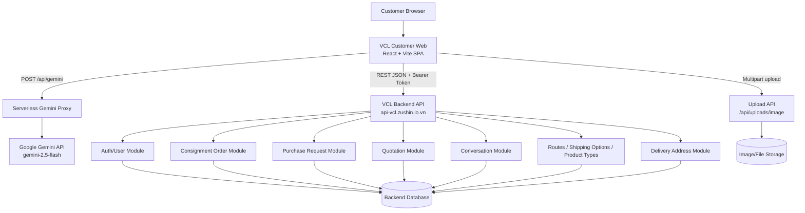
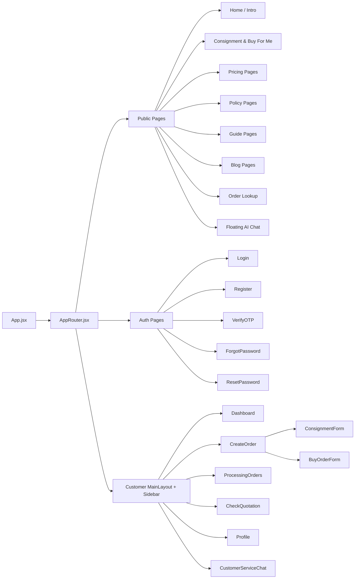
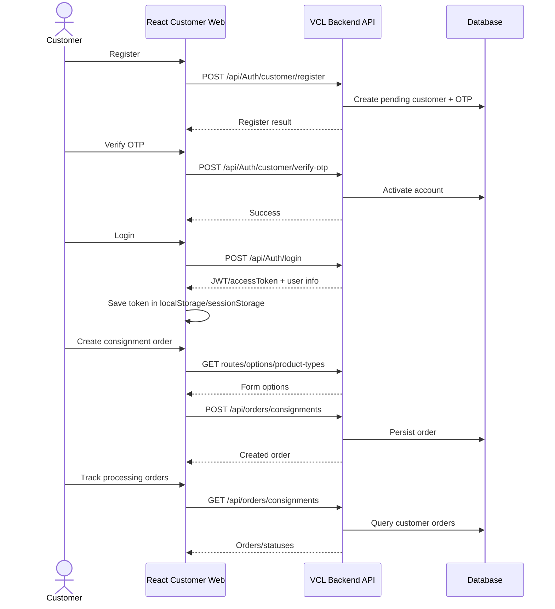
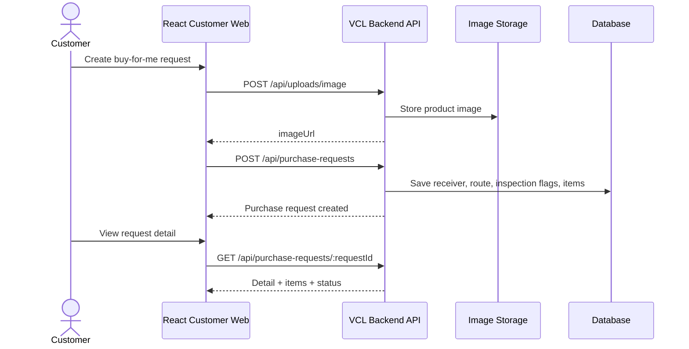
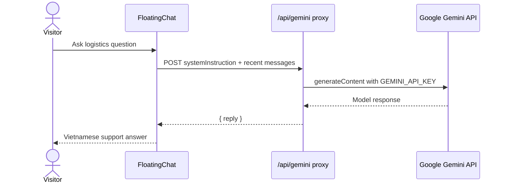

# System Design: VCL Customer Web

## Summary

VCL Customer Web is a React + Vite single-page application for customer-facing logistics workflows. It is deployed as static frontend assets and uses the VCL Backend API through REST endpoints configured by `VITE_API_BASE_URL`, with `https://api-vcl.zushin.io.vn` as the fallback base URL.

The application includes:

- Public website pages for services, pricing, policies, guides, blogs, contact, and order lookup.
- Authentication pages for registration, OTP verification, login, forgot password, and password reset.
- Customer dashboard pages for consignment orders, buy-for-me purchase requests, quotations, customer service chat, and profile management.
- Supporting integrations for image upload and an AI floating chat through a Gemini serverless proxy.

## High-Level Architecture



## Frontend Component Design



## Backend API Contracts

The frontend infers these backend-facing API contracts from its API client modules.

```mermaid
flowchart TB
  AuthUI[Auth UI] --> A1[POST /api/Auth/login]
  AuthUI --> A2[POST /api/Auth/customer/register]
  AuthUI --> A3[POST /api/Auth/customer/verify-otp]
  AuthUI --> A4[POST /api/Auth/customer/resend-otp]
  AuthUI --> A5[POST /api/Auth/forgot-password]
  AuthUI --> A6[POST /api/Auth/reset-password]

  ProfileUI[Profile UI] --> U1[GET /api/User/profile]
  ProfileUI --> U2[PUT /api/User/profile]

  ConsignUI[Consignment UI] --> C1[POST /api/orders/consignments]
  ConsignUI --> C2[GET /api/orders/consignments]
  ConsignUI --> C3[GET /api/orders/consignments/:orderId]
  ConsignUI --> C4[PUT /api/orders/consignments/:orderId/cancel]
  ConsignUI --> C5[PUT /api/orders/consignments/:orderId/status]
  ConsignUI --> C6[GET /api/orders/consignments/routes]
  ConsignUI --> C7[GET /api/orders/consignments/shipping-options]
  ConsignUI --> C8[GET /api/orders/consignments/statuses]

  PurchaseUI[Buy For Me UI] --> P1[POST /api/purchase-requests]
  PurchaseUI --> P2[GET /api/purchase-requests]
  PurchaseUI --> P3[GET /api/purchase-requests/:requestId]

  QuoteUI[Quotation UI] --> Q1[GET /api/orders/:orderId/quotation]

  ChatUI[CSKH Chat UI] --> M1[POST /api/conversations]
  ChatUI --> M2[GET /api/conversations]
  ChatUI --> M3[GET /api/conversations/:conversationId]
  ChatUI --> M4[POST /api/conversations/:conversationId/messages]
  ChatUI --> M5[PUT /api/conversations/:conversationId/read]

  SharedUI[Shared Forms] --> D1[GET /api/delivery-addresses]
  SharedUI --> D2[POST /api/delivery-addresses]
  SharedUI --> D3[DELETE /api/delivery-addresses/:id]
  SharedUI --> T1[GET /api/product-types]
  SharedUI --> I1[POST /api/uploads/image]
```



## Main User Flows







## Security And Session Design

- Protected REST calls use `Authorization: Bearer <accessToken>`.
- The token lookup order is `sessionStorage.accessToken`, then `localStorage.accessToken`.
- A non-login `401` response clears stored tokens and redirects the customer to `/login`.
- User profile display data is synchronized mostly through `sessionStorage`.
- Image upload uses `multipart/form-data`; the browser sets the request boundary automatically.
- The Gemini API key must remain server-side in `GEMINI_API_KEY`; the browser only calls `/api/gemini`.

## Deployment Design

```mermaid
flowchart LR
  Dev[Developer] --> Build[Vite build]
  Build --> Dist[Static dist assets]
  Dist --> Vercel[Vercel / Static Hosting]
  Vercel --> Browser[Customer Browser]

  Browser --> Backend[VCL Backend API]
  Browser --> GeminiRoute[/api/gemini]
  GeminiRoute --> Gemini[Google Gemini]
```

Deployment requirements:

- Configure `VITE_API_BASE_URL` for the target VCL Backend API when not using the production fallback.
- Configure `GEMINI_API_KEY` in the serverless hosting environment.
- Keep SPA fallback rewrites so client-side routes load `index.html`.
- Keep the Gemini proxy at root-level `api/gemini.js` so `/api/gemini` resolves as a serverless function on Vercel.

## Assumptions

- Backend internals, database schema, admin/staff services, payment module, notifications, and warehouse operations are not present in this repository.
- The backend modules in the architecture diagrams are inferred from frontend API calls.
- The external VCL Backend API remains the source of truth for business data.
